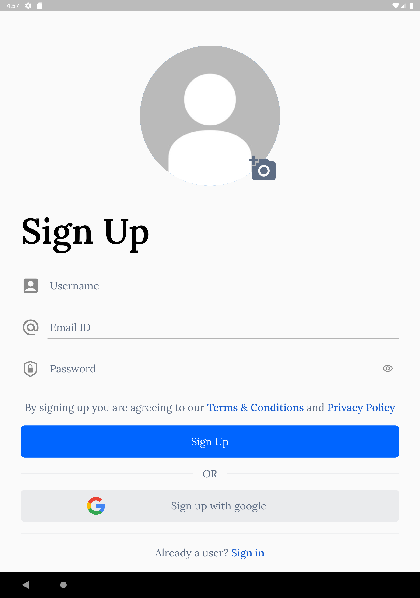

# Flutter-Firebase-Auth
Hi guys, this is a simple authentication app I created using Firebase Authentication/Storage. 
It is a responsive design and works both on Android and IOS
It consist of a sign in and login page, where you can sign in/login with your email and password or with google sign in. 
After which you would be redirected to an Homepage.
It has a nice user interface with great User experience.

